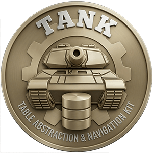

    

# tank-core

Core logic and traits for [Tank](https://crates.io/crates/tank): the Rust data layer.

This crate defines the types that form the foundation of the library. It is intended to be used by driver implementors. For application development, depend on `tank` instead.

📘 https://tankhq.github.io/tank

⭐ https://github.com/TankHQ/tank

📦 https://crates.io/crates/tank
